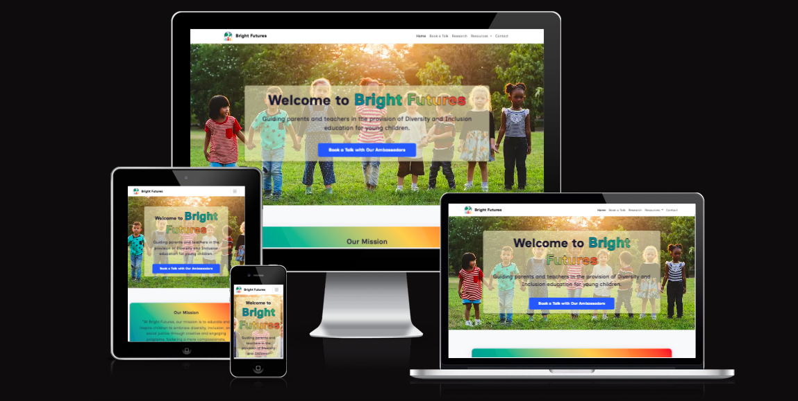

# Bright Futures 2

  

| <a href="https://gerbil1511.github.io/Bright-Futures-2/index.html" target="_blank">Live Project</a> |

## Introduction 

A further developed version of my first individual formative HTML, CSS & Bootstrap assignment for the Code Institute AI Augmented FullStack Bootcamp [Bright Futures](https://github.com/Gerbil1511/Bright-Futures), that now has some additional javascript and content animations.
I created a project based upon the goals and features proposed in Project 1: "Diversity & Inclusion". Inspired by my real life experience of having a sibling with physical disabilities (Spina Biffida and Hydrocephalus), and how in their early years it was very apparent that he experieinced some barriers to inclusion which may have had an impact on his world view/attitude and personal development. My aim was to create a website for a mock company that supports parent and educators/teachers in guiding and empowering younger generations in fostering a more compassionate and empathetic view ensuring all people are welcome and feel they belong.

